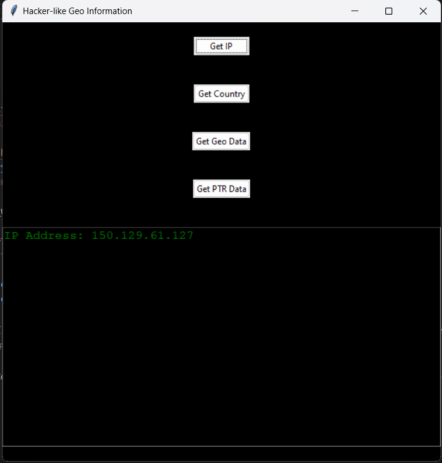

# Hacker-like Geo Information App

A simple GUI application built using `tkinter` that provides various geographical information based on the user's IP address.

## Details

This application uses the following Python modules:

- `tkinter`: For creating the GUI.
- `ttk`: For theming capabilities.
- `font`: For customizing text fonts.
- `geo`: A custom or third-party module that provides geographical data.
- `random`: For generating random strings.
- `string`: For string manipulation.

You might need to install some of these, especially `geo`, before you can run the application. 

## Features

- Fetch and display your IP address.
- Display country information based on IP.
- Detailed geo-data including city, region, and more.
- PTR data for the IP.
- Cool hacker-like animation effect before displaying the information.

## Getting Started

1. Clone the GitHub repository.
2. Navigate to the directory.
3. Install the necessary modules: pip install -r requirements.txt
4. Run the application: python test.py

## How to Use

1. Start the application.
2. Click on one of the buttons (`Get IP`, `Get Country`, `Get Geo Data`, `Get PTR Data`) to retrieve and display the corresponding data.

## Screenshots

## Contributions

Feel free to fork this repository and open a pull request to suggest any updates you think can improve the application.

## License

This project is licensed under the MIT License. 

## Acknowledgment

- The `geo` library developers for making geographical data accessible.
